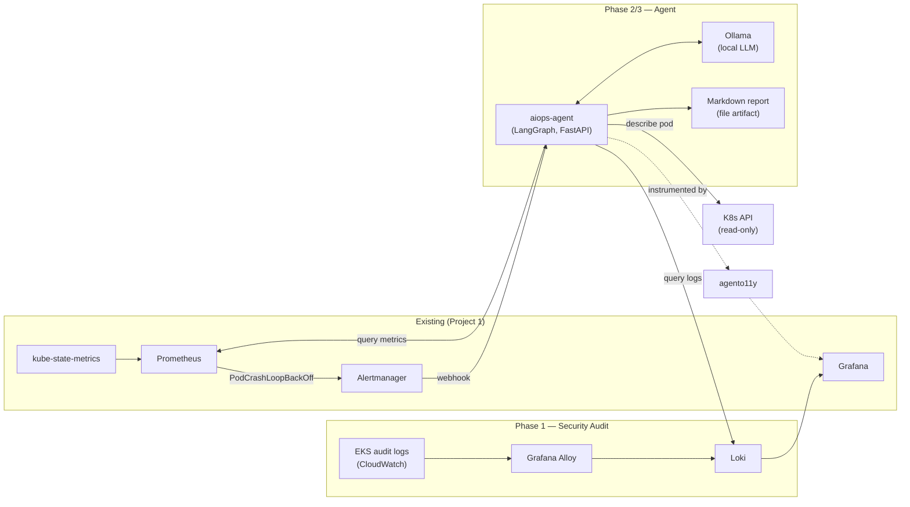

# AIOps: LangGraph Incident-Investigation Agent & K8s Security Audit Pipeline

**Scope, stated up front:** this is deliberately **one small, working
two-node agent** plus a security audit pipeline — not a multi-agent "SRE war
room." Depth beats breadth here: a two-node graph you can fully explain from
memory is worth more than an elaborate one you can't. See "Explicit
non-goals" at the bottom.

Rides on **Project 1's existing EKS cluster** (`eks-httpbin-alb`) —
Prometheus/Alertmanager/kube-state-metrics and the `monitoring` namespace's
Grafana are reused, not duplicated. No parallel cluster, no second Grafana.

## What this demonstrates

| Area | What's here | Phase |
| --- | --- | --- |
| Agentic application development | LangGraph, 2-node graph (Investigator → Reporter), read-only tools | Phase 2 |
| K8s security observability | Scoped audit policy → Grafana Alloy → Loki, RBAC-change + exec alerting | Phase 1 |
| Alert-driven automation | Alertmanager webhook triggers the agent; no polling | Phase 2 |
| AI observability | `agento11y` (Grafana Agent Observability) instrumenting the agent's own runs | Phase 3 |
| Safety-by-design | Read-only RBAC + no write-capable tool code, enforced at two independent layers | Phase 0/2 |

## Naming note: Grafana Sigil SDK → agento11y

The original idea referenced "Grafana Sigil SDK." Grafana renamed this
product mid-2026: `sigil-sdk` → **`agento11y`** (Grafana Agent
Observability). APIs are unchanged, only the package/import name moved.
Everything here targets the current name (`agento11y`) — see
`agent/app/observability.py` for the instrumentation and its own note on
this.

## Architecture



## Incident scenario (Phase 0)

Chosen scenario: **a pod goes CrashLoopBackOff** in the `httpbin` namespace
(`incident-scenario/broken-deployment.yaml` deploys an intentionally
broken demo pod so this is trigger-on-demand, not something you have to
wait for or fake). Kept to this one scenario deliberately — see Phase 0 in
`PLAN-project4-aiops.md`.

## Output (Phase 2.3)

The Reporter node writes a Markdown file per investigation
(`incident-reports/<timestamp>_<alert>_<pod>.md`) — a real, inspectable
artifact you can commit or attach to a ticket, not a live chat demo that
only works when someone's watching. (Decision made explicitly over a Slack
webhook, to keep the demo self-contained and not dependent on a Slack
workspace.)

## Repository layout

```
security-audit/     Phase 1 — audit policy, Alloy config, Loki, dashboards, alerts
incident-scenario/  Phase 0 — the chosen CrashLoopBackOff demo + its PrometheusRule
alertmanager/       Webhook receiver wiring (AlertmanagerConfig CRD)
agent/              Phase 2/3 — the LangGraph agent, its k8s manifests, its GitOps app
```

## Verification status

**Code-complete, not yet run against a live cluster or a real fired
alert.** Same posture as Project 1's later phases: this was authored as a
complete, internally consistent design without access to a live AWS
account/network, so treat it like a thorough PR from a colleague — read it,
run it, expect small first-contact fixes (a chart values field renamed
between versions, an RBAC verb you need to add). That debugging is itself
covered as an exercise in the study guide, not glossed over. The
per-phase checkpoints (a real dashboard screenshot, a real captured
investigation) are yours to produce by actually running this against your
EKS cluster — see each phase's own README for the concrete steps.

## Explicit non-goals (do not scope-creep)

- No large multi-agent "war room" with many specialized roles.
- No autonomous remediation actions taken by the agent — investigation
  only, read-only tools, human decides and acts.
- No parallel cluster — this rides on Project 1's existing infrastructure.
